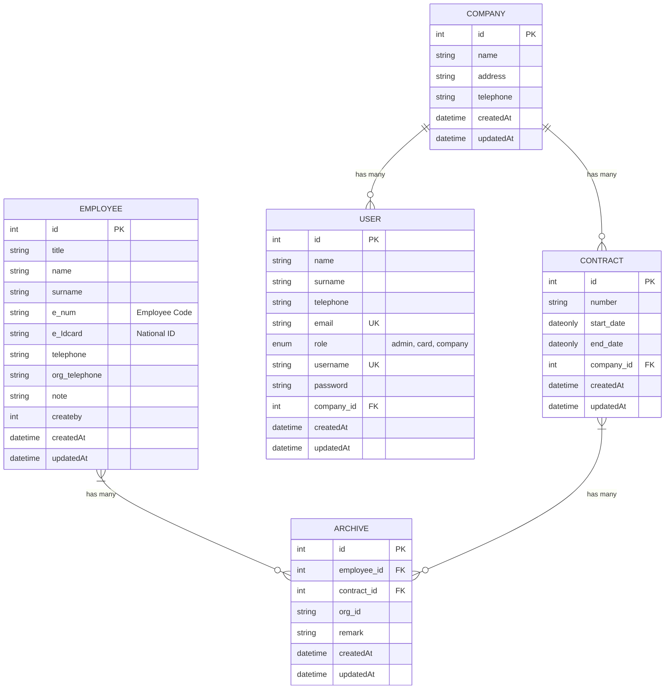
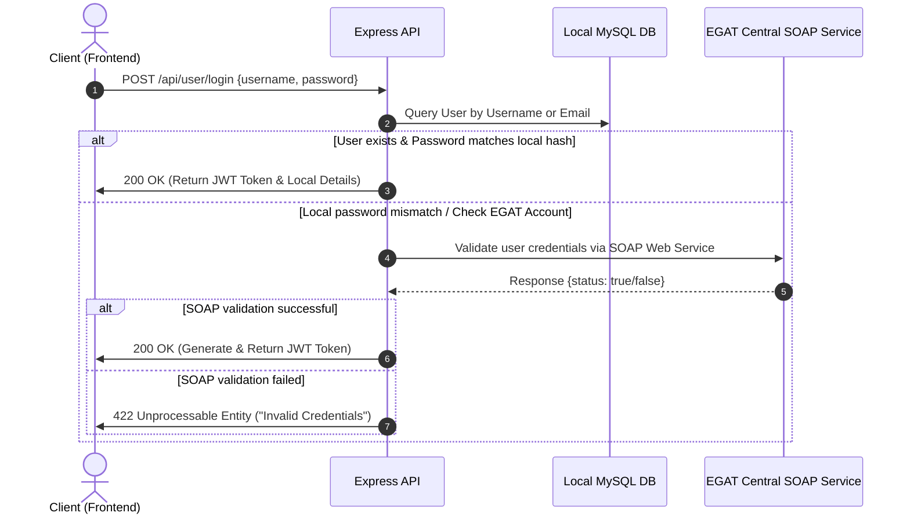

# ⚡ Contact-EMP — Employee & Contractor Contact Management System
### 🏢 EGAT | Full-Stack Developer Internship Project (May 2023 – Sep 2023)

[](https://react.dev/)
[](https://nodejs.org/)
[](https://sequelize.org/)
[](https://www.egat.co.th/)

> [!IMPORTANT]
> This repository contains the **Contact-EMP** system, developed during a **Full-Stack Developer Internship** at the **Electricity Generating Authority of Thailand (EGAT)**. It was built to optimize employee contact tracking, manage contractor assignments, and streamline internal organization workflows.

---

## 📖 Project Overview

**Contact-EMP** is an enterprise-grade employee and external contractor contact management system. It enables secure role-based directory management, comprehensive contract tracking, and historical archiving of external personnel working under contracts for EGAT. 

To ensure maximum efficiency and reduce administrative overhead, the application integrates directly with:
1. **EGAT Central SOAP Web Service (`au_provi.php`)**: For seamless Single Sign-On (SSO) credential validation.
2. **EGAT HR REST API (`hrapi.egat.co.th`)**: For retrieving real-time employee profiles, department hierarchies, and work locations automatically based on employee codes.

---

## 🌟 Key Contributions & Achievements

* **Full-Stack Implementation**: Built the end-to-end architecture featuring a rich responsive Single Page Application (SPA) frontend and a modular RESTful API backend.
* **Dual-Authentication Scheme**: Implemented a secure authentication flow that validates local accounts using **Passport JWT + bcrypt** and integrates with **EGAT SOAP Web Services** for seamless employee authentication.
* **Enterprise API Integrations**: Developed robust API connectors to fetch live personnel data (positions, subdivisions, locations) from EGAT's official HR system.
* **Data Visualization Dashboards**: Constructed interactive graphs and KPI cards using **Nivo Charts & Chart.js** to present high-level statistics on active companies, contracts, and active employees.
* **Advanced Relational Modeling**: Structured database schemas using **Sequelize ORM** with complex many-to-many associations (e.g. tracking multiple historical contracts for an employee using a junction table).

---

## 🛠️ Technology Stack

The project is structured as a decoupled monorepo with dedicated frontend and backend modules:

### 💻 Frontend (`contract-emp-frontend`)
* **Core Framework**: React (v18)
* **State Management**: Redux Toolkit & React Redux (global dark/light theme & auth state persistence)
* **UI & Styling**: Material-UI (MUI v5) for sleek components, React-Bootstrap, React Pro-Sidebar
* **Data Visualization**: Nivo Charts (`@nivo/bar`, `@nivo/line`, `@nivo/pie`), Chart.js, React Google Charts
* **Forms & Validation**: Formik, React Hook Form, and Yup
* **Routing**: React Router DOM (v6) with layout templates
* **HTTP Client**: Axios with interceptors

### ⚙️ Backend (`contract-emp-backend`)
* **Core Server**: Node.js & Express.js
* **Database & ORM**: MySQL & Sequelize ORM
* **Security & Auth**: JWT (JsonWebToken), Bcrypt password hashing, Passport.js with JWT Strategy
* **Protocols**: REST API, SOAP (via `soap` library for internal authentication)

---

## 📊 Database ER Schema & Architecture

The system utilizes a relational database mapped elegantly using **Sequelize**. Below is the entity-relationship model highlighting the database design:



---

## 🔑 Authentication Workflow (Dual Auth Strategy)

The system supports two methods of authentication, allowing both internal EGAT officers and external contractors to log in securely:



---

## 📁 Project Directory Structure

```text
contact-emp/
├── contract-emp-backend/       # Node.js & Express REST API
│   ├── auth/                   # Passport JWT strategies
│   ├── config/                 # Database configurations
│   ├── controller/             # Controller logic for endpoints
│   ├── middleware/             # SOAP connector & authentication hooks
│   ├── models/                 # Sequelize MySQL models
│   ├── routes/                 # Route mappings
│   ├── server.js               # Express application entrypoint
│   └── package.json
└── contract-emp-frontend/      # React Single Page Application (SPA)
    ├── public/                 # Static assets
    └── src/
        ├── component/          # Shared components (Sidebar, Navbar, DataGrid, Charts)
        ├── layouts/            # Page shell layout wrappers
        ├── pages/              # Visual modules (Dashboard, Employee, Contract, Archive)
        ├── services/           # Axios HTTP request services
        ├── states/             # Redux state management slices
        ├── theme.js            # MUI Custom Dark/Light theme settings
        ├── App.js              # Application router configurations
        └── index.js            # React mounting file
```

---

## 🛡️ Role-Based Access Control (RBAC) Matrix

To protect sensitive employee information, three specific roles govern system interaction:

| Feature / Action | 👑 Admin | 🪪 Card (Officer) | 🏢 Company (Partner) |
| :--- | :---: | :---: | :---: |
| **View Dashboard & Visual Analytics** | ✅ | ✅ | ⚠️ (Own Company Only) |
| **Manage / Register Local Users** | ✅ | ✅ (Excl. Admins) | ❌ |
| **Create & Edit Companies** | ✅ | ✅ | ❌ |
| **Create, Update & Search Contracts** | ✅ | ✅ | ⚠️ (Own Contracts Only) |
| **Sync Employees with EGAT HR API** | ✅ | ✅ | ❌ |
| **Manage Employee-Contract Archives**| ✅ | ✅ | ❌ |
| **Read Directories & Contact Info** | ✅ | ✅ | ✅ |

---

## 🚀 Getting Started

### Prerequisites
* **Node.js** (v16.x or newer)
* **MySQL Server** (v8.0 or newer)

---

### 1. Backend Setup

1. Navigate to the backend directory:
   ```bash
   cd contract-emp-backend
   ```
2. Install dependencies:
   ```bash
   npm install
   ```
3. Configure the environment variables. Create a file named `config.env` (or update the existing one) with the following structure:
   ```env
   PORT=8080
   JWT_SECRET=your_jwt_secret_token_here
   DB_HOST=127.0.0.1
   DB_USER=your_db_user
   DB_PASSWORD=your_db_password
   DB_NAME=contact_emp_db
   DB_PORT=3306
   DB_DIALECT=mysql
   ```
4. Run the development server (automatically syncs the database schema on launch):
   ```bash
   npm run dev
   ```

---

### 2. Frontend Setup

1. Navigate to the frontend directory:
   ```bash
   cd ../contract-emp-frontend
   ```
2. Install dependencies:
   ```bash
   npm install
   ```
3. Start the React development server:
   ```bash
   npm start
   ```
4. Open [http://localhost:3000](http://localhost:3000) in your browser.

---

## 💡 Key API Integrations Details

### 📡 EGAT HR API Integration
* **Endpoint**: `https://hrapi.egat.co.th/api/v1/persons`
* **Purpose**: Fetches real-time employee data automatically using their unique Employee Code.
* **Payload Structure Extracted**:
  ```json
  {
    "filter": {
      "PersonCode": "00XXXXXX"
    },
    "include": "work_locations,positions"
  }
  ```

### 🔒 SOAP Authentication Integration
* **WSDL Client Endpoint**: `http://webservices.egat.co.th/authentication/au_provi.php?wsdl`
* **Action Call**: `soapClient.validate_user({ a: username, b: password })`
* **Behavior**: Validates security context with EGAT identity directory directly, without storing corporate passwords locally.

---

## ⚖️ License
This project was developed exclusively for **Electricity Generating Authority of Thailand (EGAT)** as part of an internal systems modernization internship program. All rights reserved.
